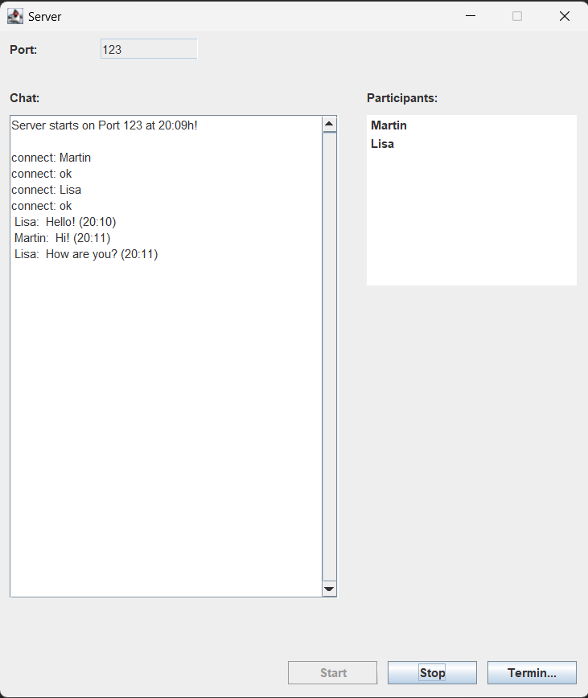
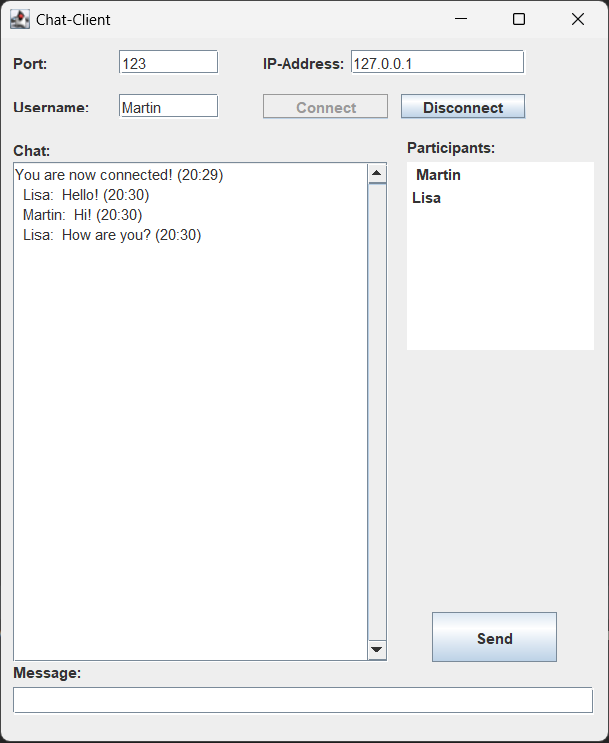

# <ins>Chat App:</ins>
 

#### <ins>General Information:</ins>
Chat App is a group chat that allows multiple users to communicate with each other in real time. This project was developed during my bachelor's degree and is one of my first major software projects.  

#### <ins>How It Works:</ins>
The application consists of two main components: the server and the client. The server manages the users' connections and messages, while the client application provides the user interface for interaction in the chat.  

#### <ins>Installation And Setup:</ins>
To use the chat app, start the server and then the client application.

- <ins>Start server:</ins>
    - Navigate to the project directory.
    - Execute ``ServerGUI.java`` in ``src.server`` to start the server.

- <ins>Start client:</ins>
    - After the server is running, you can start the client application.
    - Execute ``ClientGUI.java`` in ``src.client`` to open the client.  

#### <ins>Server GUI:</ins>

  

#### <ins>Client GUI:</ins>

  

#### <ins>Usage:</ins>
Once both the server and the client have been started, users can use the chat app to send and receive messages. Simply start the client application and connect to the server to enter the chat.